**Hey there, I'm Rodrigo** 👋

Follow me on Twitter [@mathsppblog][twitter] for 🐍 Python, 🧠 maths, and 💻 programming content.

## A little bit about myself

- 🔭 I’m currently working on my personal project: [mathspp.com](https://mathspp.com)
- 💬 Ask me about mathematics, programming and bad jokes.
- 📫 You can find my contacts [here](https://mathspp.com/contact-me).
- 😄 Pronouns: he/him/his

## 📖 My most recent articles

<!-- BLOG-POST-LIST:START -->
- [TIL #123 – The appearing built-in](https://mathspp.com/blog/til/the-appearing-builtin)
- [TIL #122 – CLI tools with extra dependencies](https://mathspp.com/blog/til/cli-tools-with-extra-dependencies)
- [Module enum overview](https://mathspp.com/blog/module-enum-overview)
- [TIL #121 – uv escape hatch](https://mathspp.com/blog/til/use-pip-directly-from-a-uv-virtual-environment)
- [TIL #120 – Circle vs rectangle collision detection](https://mathspp.com/blog/til/circle-vs-rectangle-collision-detection)
- [Binary search as a bidirectional generator](https://mathspp.com/blog/binary-search-as-a-bidirectional-generator)
- [JavaScript 2D scrolling game tutorial](https://mathspp.com/blog/javascript-2d-scrolling-game-tutorial)
<!-- BLOG-POST-LIST:END -->

##  My GitHub activity stats

<!-- Thanks to ofek! -->

[twitter]: https://twitter.com/mathsppblog
