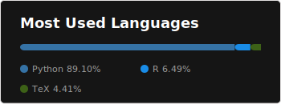

**Hey there, I'm Rodrigo** 👋

Follow me on Twitter [@mathsppblog][twitter] for 🐍 Python, 🧠 maths, and 💻 programming content.

## A little bit about myself

- 🔭 I’m currently working on my personal project: [mathspp.com](https://mathspp.com)
- 💬 Ask me about mathematics, programming and bad jokes.
- 📫 You can find my contacts [here](https://mathspp.com/contact-me).
- 😄 Pronouns: he/him/his

## 📖 My most recent articles

<!-- BLOG-POST-LIST:START -->
- [TIL #140 – Install Jupyter with uv](https://mathspp.com/blog/til/install-jupyter-with-uv)
- [TIL #139 – Multiline input in the REPL](https://mathspp.com/blog/til/multiline-input-in-the-repl)
- [Remove extra spaces](https://mathspp.com/blog/remove-extra-spaces)
- [Recursive structural pattern matching](https://mathspp.com/blog/recursive-structural-pattern-matching)
- [TIL #138 – Custom directives in Jupyter Book](https://mathspp.com/blog/til/custom-directives-in-jupyter-book)
- [Generalising itertools.pairwise](https://mathspp.com/blog/generalising-itertools-pairwise)
- [TIL #137 – Inline SVGs in Jupyter notebooks](https://mathspp.com/blog/til/inline-svgs-in-jupyter-notebooks)
<!-- BLOG-POST-LIST:END -->

##  My GitHub activity stats

<!-- Thanks to ofek! -->

[twitter]: https://twitter.com/mathsppblog
